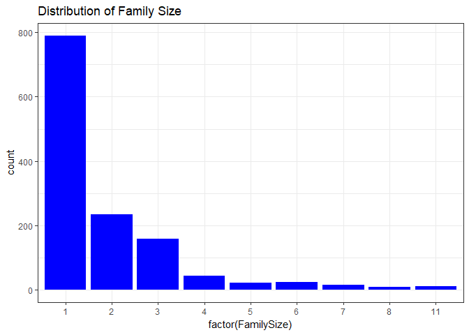
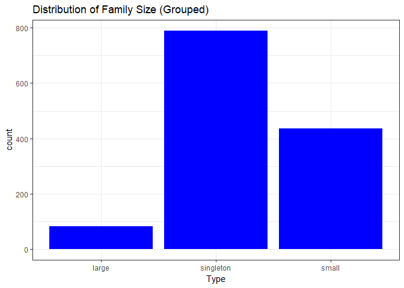
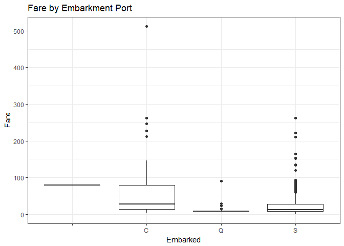
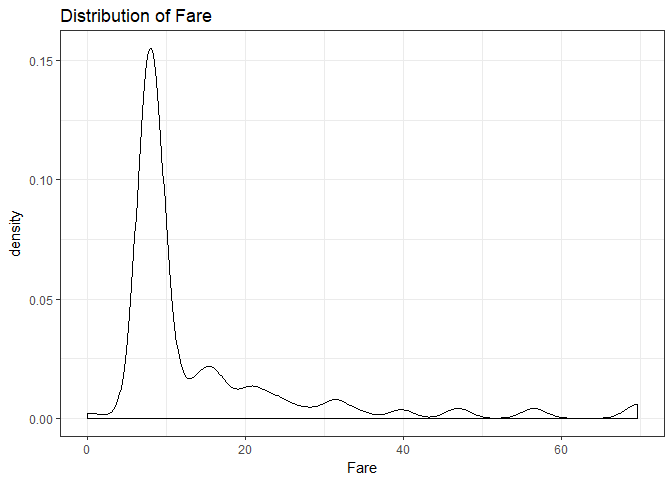
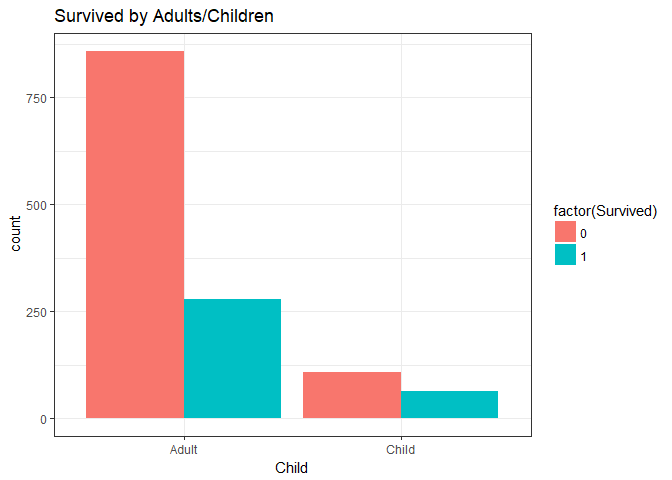
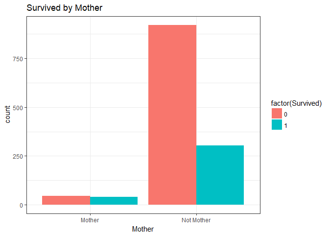

Titanic\_kaggle
================
Gaurav Singh
4 May 2018

The following document is a step by step process for solving the Titanic: Machine Learning from Disaster competition in kaggle. The problem at hand was to predict which passengers survived the tragedy. My main focus in this project was on feature engineering and modelling.

The competition details can be found on <https://www.kaggle.com/c/titanic>

I have used the random forest classification model and have achieved 80.4% accuracy which is in the top 9% rank.

Loading the required packages
=============================

``` r
library(dplyr)
library(ggplot2)
library(tidyr)
library(parallel)
library(randomForest)
library(caret)
library(car)
```

Reading in the datasets
=======================

``` r
train <- read.csv('Datasets/train.csv')
test <- read.csv('Datasets/test.csv')
```

Looking at the structure of the train dataset
=============================================

``` r
glimpse(train)
```

    ## Observations: 891
    ## Variables: 12
    ## $ PassengerId <int> 1, 2, 3, 4, 5, 6, 7, 8, 9, 10, 11, 12, 13, 14, 15,...
    ## $ Survived    <int> 0, 1, 1, 1, 0, 0, 0, 0, 1, 1, 1, 1, 0, 0, 0, 1, 0,...
    ## $ Pclass      <int> 3, 1, 3, 1, 3, 3, 1, 3, 3, 2, 3, 1, 3, 3, 3, 2, 3,...
    ## $ Name        <fct> Braund, Mr. Owen Harris, Cumings, Mrs. John Bradle...
    ## $ Sex         <fct> male, female, female, female, male, male, male, ma...
    ## $ Age         <dbl> 22, 38, 26, 35, 35, NA, 54, 2, 27, 14, 4, 58, 20, ...
    ## $ SibSp       <int> 1, 1, 0, 1, 0, 0, 0, 3, 0, 1, 1, 0, 0, 1, 0, 0, 4,...
    ## $ Parch       <int> 0, 0, 0, 0, 0, 0, 0, 1, 2, 0, 1, 0, 0, 5, 0, 0, 1,...
    ## $ Ticket      <fct> A/5 21171, PC 17599, STON/O2. 3101282, 113803, 373...
    ## $ Fare        <dbl> 7.2500, 71.2833, 7.9250, 53.1000, 8.0500, 8.4583, ...
    ## $ Cabin       <fct> , C85, , C123, , , E46, , , , G6, C103, , , , , , ...
    ## $ Embarked    <fct> S, C, S, S, S, Q, S, S, S, C, S, S, S, S, S, S, Q,...

We can see that there are 891 observations and 12 variables.

Looking at the structure of the test dataset
============================================

``` r
glimpse(test)
```

    ## Observations: 418
    ## Variables: 11
    ## $ PassengerId <int> 892, 893, 894, 895, 896, 897, 898, 899, 900, 901, ...
    ## $ Pclass      <int> 3, 3, 2, 3, 3, 3, 3, 2, 3, 3, 3, 1, 1, 2, 1, 2, 2,...
    ## $ Name        <fct> Kelly, Mr. James, Wilkes, Mrs. James (Ellen Needs)...
    ## $ Sex         <fct> male, female, male, male, female, male, female, ma...
    ## $ Age         <dbl> 34.5, 47.0, 62.0, 27.0, 22.0, 14.0, 30.0, 26.0, 18...
    ## $ SibSp       <int> 0, 1, 0, 0, 1, 0, 0, 1, 0, 2, 0, 0, 1, 1, 1, 1, 0,...
    ## $ Parch       <int> 0, 0, 0, 0, 1, 0, 0, 1, 0, 0, 0, 0, 0, 0, 0, 0, 0,...
    ## $ Ticket      <fct> 330911, 363272, 240276, 315154, 3101298, 7538, 330...
    ## $ Fare        <dbl> 7.8292, 7.0000, 9.6875, 8.6625, 12.2875, 9.2250, 7...
    ## $ Cabin       <fct> , , , , , , , , , , , , B45, , E31, , , , , , , , ...
    ## $ Embarked    <fct> Q, S, Q, S, S, S, Q, S, C, S, S, S, S, S, S, C, Q,...

We can see that there are 418 observations and only 11 variables.

Combine train and test set
==========================

``` r
test$Survived <- 0
titanic.full <- rbind(train, test)
glimpse(titanic.full)
```

    ## Observations: 1,309
    ## Variables: 12
    ## $ PassengerId <int> 1, 2, 3, 4, 5, 6, 7, 8, 9, 10, 11, 12, 13, 14, 15,...
    ## $ Survived    <dbl> 0, 1, 1, 1, 0, 0, 0, 0, 1, 1, 1, 1, 0, 0, 0, 1, 0,...
    ## $ Pclass      <int> 3, 1, 3, 1, 3, 3, 1, 3, 3, 2, 3, 1, 3, 3, 3, 2, 3,...
    ## $ Name        <fct> Braund, Mr. Owen Harris, Cumings, Mrs. John Bradle...
    ## $ Sex         <fct> male, female, female, female, male, male, male, ma...
    ## $ Age         <dbl> 22, 38, 26, 35, 35, NA, 54, 2, 27, 14, 4, 58, 20, ...
    ## $ SibSp       <int> 1, 1, 0, 1, 0, 0, 0, 3, 0, 1, 1, 0, 0, 1, 0, 0, 4,...
    ## $ Parch       <int> 0, 0, 0, 0, 0, 0, 0, 1, 2, 0, 1, 0, 0, 5, 0, 0, 1,...
    ## $ Ticket      <fct> A/5 21171, PC 17599, STON/O2. 3101282, 113803, 373...
    ## $ Fare        <dbl> 7.2500, 71.2833, 7.9250, 53.1000, 8.0500, 8.4583, ...
    ## $ Cabin       <fct> , C85, , C123, , , E46, , , , G6, C103, , , , , , ...
    ## $ Embarked    <fct> S, C, S, S, S, Q, S, S, S, C, S, S, S, S, S, S, Q,...

I combined both the train set and test set so that I could preprocess the entire dataset simultaneously.

Feature Engineering
===================

Dealing with titles
-------------------

``` r
regex <- gregexpr(', [^\\..]+.', titanic.full$Name)
titles <- regmatches(titanic.full$Name, regex)
titles <- gsub(', ', "", titles)
titles <- gsub('.', "", titles, fixed = TRUE)
titanic.full$Title <- titles
```

I extracted the titles from the Name column and placed it in a new column named Title. This was done as I felt that it could be a good variable to predict whether an individual would survive or not as individuals with a more prestigious title would have first priority on getting a safety boat and hence more likely to survive.

``` r
table(titanic.full$Title)
```

    ## 
    ##         Capt          Col          Don         Dona           Dr 
    ##            1            4            1            1            8 
    ##     Jonkheer         Lady        Major       Master         Miss 
    ##            1            1            2           61          260 
    ##         Mlle          Mme           Mr          Mrs           Ms 
    ##            2            1          757          197            2 
    ##          Rev          Sir the Countess 
    ##            8            1            1

Since many titles occur rarely i.e. have very low frequency, I decided to combine them into a new level named rare.title if they occured less than 10 times.

``` r
rare.title <- names(table(titanic.full$Title))[table(titanic.full$Title) < 10][-9:-11]
titanic.full$Title[titanic.full$Title %in% rare.title]  <- 'Rare_Title'
```

Next, I also wanted to fix some obvious typos in the Title column.

``` r
titanic.full$Title[titanic.full$Title == 'Mlle']        <- 'Miss' 
titanic.full$Title[titanic.full$Title == 'Ms']          <- 'Miss'
titanic.full$Title[titanic.full$Title == 'Mme']         <- 'Mrs' 
table(titanic.full$Title)
```

    ## 
    ##     Master       Miss         Mr        Mrs Rare_Title 
    ##         61        264        757        198         29

The Title column looks much more organised now.

Family Size
===========

I figured out a way to determine the family size of an individual using the SibSp and Parch columns.

``` r
titanic.full$FamilySize <- 1 + titanic.full$SibSp + titanic.full$Parch
```

``` r
ggplot(data = titanic.full, aes(x = factor(FamilySize))) + geom_bar(fill = "blue") + ggtitle("Distribution of Family Size") + theme_bw()
```



We can see that very few individuals have a family size greater than 4.

Family Size Discretized
=======================

Based on the above distribution, I decided to group the FamilySize variable.

``` r
titanic.full$FamilySizeDis[titanic.full$FamilySize == 1] <- 'singleton'
titanic.full$FamilySizeDis[titanic.full$FamilySize < 5 & titanic.full$FamilySize > 1] <- 'small'
titanic.full$FamilySizeDis[titanic.full$FamilySize > 4] <- 'large'
ggplot(titanic.full, aes(x = FamilySizeDis)) + geom_bar(fill = "blue") + ggtitle("Distribution of Family Size (Grouped)") + theme_bw() + xlab("Type")
```



Cabin Level
===========

I extracted the first letters of the Cabin column as it might represent the level it is situated in the ship and hence might have some relation with Survived.

``` r
cabin.level <- substr(titanic.full$Cabin, 1, 1)
table(cabin.level)
```

    ## cabin.level
    ##         A    B    C    D    E    F    G    T 
    ## 1014   22   65   94   46   41   21    5    1

``` r
titanic.full$Cabin.Level <- cabin.level
```

We see that majority of the Cabins do not have any levels associated with it.

Dealing with Missing Values
===========================

``` r
str(titanic.full)
```

    ## 'data.frame':    1309 obs. of  16 variables:
    ##  $ PassengerId  : int  1 2 3 4 5 6 7 8 9 10 ...
    ##  $ Survived     : num  0 1 1 1 0 0 0 0 1 1 ...
    ##  $ Pclass       : int  3 1 3 1 3 3 1 3 3 2 ...
    ##  $ Name         : Factor w/ 1307 levels "Abbing, Mr. Anthony",..: 109 191 358 277 16 559 520 629 417 581 ...
    ##  $ Sex          : Factor w/ 2 levels "female","male": 2 1 1 1 2 2 2 2 1 1 ...
    ##  $ Age          : num  22 38 26 35 35 NA 54 2 27 14 ...
    ##  $ SibSp        : int  1 1 0 1 0 0 0 3 0 1 ...
    ##  $ Parch        : int  0 0 0 0 0 0 0 1 2 0 ...
    ##  $ Ticket       : Factor w/ 929 levels "110152","110413",..: 524 597 670 50 473 276 86 396 345 133 ...
    ##  $ Fare         : num  7.25 71.28 7.92 53.1 8.05 ...
    ##  $ Cabin        : Factor w/ 187 levels "","A10","A14",..: 1 83 1 57 1 1 131 1 1 1 ...
    ##  $ Embarked     : Factor w/ 4 levels "","C","Q","S": 4 2 4 4 4 3 4 4 4 2 ...
    ##  $ Title        : chr  "Mr" "Mrs" "Miss" "Mrs" ...
    ##  $ FamilySize   : num  2 2 1 2 1 1 1 5 3 2 ...
    ##  $ FamilySizeDis: chr  "small" "small" "singleton" "small" ...
    ##  $ Cabin.Level  : chr  "" "C" "" "C" ...

I first wanted to get rid of "" factor level in the Embarked column.

Embarked
--------

``` r
titanic.full %>% filter(Embarked == "")
```

    ##   PassengerId Survived Pclass                                      Name
    ## 1          62        1      1                       Icard, Miss. Amelie
    ## 2         830        1      1 Stone, Mrs. George Nelson (Martha Evelyn)
    ##      Sex Age SibSp Parch Ticket Fare Cabin Embarked Title FamilySize
    ## 1 female  38     0     0 113572   80   B28           Miss          1
    ## 2 female  62     0     0 113572   80   B28            Mrs          1
    ##   FamilySizeDis Cabin.Level
    ## 1     singleton           B
    ## 2     singleton           B

We see that both these embarkments have a fare of 80. I decided to use this for imputing these values logically.

``` r
ggplot(titanic.full, aes(x = Embarked, y = Fare)) + geom_boxplot() + ggtitle("Fare by Embarkment Port") + theme_bw()
```



We see that Embarkment port C coincides nicely with the Fare of 80. Hence, I decided to replace these values with 'C'.

``` r
titanic.full[c(62,830), 'Embarked'] <- 'C'
```

``` r
colSums(is.na(titanic.full))
```

    ##   PassengerId      Survived        Pclass          Name           Sex 
    ##             0             0             0             0             0 
    ##           Age         SibSp         Parch        Ticket          Fare 
    ##           263             0             0             0             1 
    ##         Cabin      Embarked         Title    FamilySize FamilySizeDis 
    ##             0             0             0             0             0 
    ##   Cabin.Level 
    ##             0

We see that Fare has 1 missing value and Age has 263. The remaining columns do not have any missing values.

Fare
----

``` r
titanic.full %>% filter(is.na(Fare))
```

    ##   PassengerId Survived Pclass               Name  Sex  Age SibSp Parch
    ## 1        1044        0      3 Storey, Mr. Thomas male 60.5     0     0
    ##   Ticket Fare Cabin Embarked Title FamilySize FamilySizeDis Cabin.Level
    ## 1   3701   NA              S    Mr          1     singleton

I visualised the distribution of fare using the Pclass and Embarked of the missing column which is 3 and 'S' respectively.

``` r
ggplot(titanic.full[titanic.full$Pclass == 3 & titanic.full$Embarked == 'S', ], aes(x = Fare)) + geom_density() + scale_x_continuous() + ggtitle("Distribution of Fare") + theme_bw()
```



Looking at this distribution, since it is fairly right skewed, I decided go replace the missing value with the median.

``` r
titanic.full$Fare[1044] <- median(titanic.full[titanic.full$Pclass == 3 & titanic.full$Embarked == 'S', 'Fare'], na.rm = TRUE)
```

Data Type Conversion
--------------------

Before proceeding on to deal with missing age values, I converted the relevant columns to their appropriate data types.

``` r
factor.vars <- c('PassengerId', 'Pclass', 'Title', 'FamilySize', 'FamilySizeDis', 'Cabin.Level')
titanic.full[factor.vars] <- lapply(titanic.full[factor.vars], function(x){as.factor(x)})
```

Age
---

``` r
titanic.full.dummy.model <- dummyVars(~. -PassengerId -Name -Ticket -Cabin -Survived -Cabin.Level, data = titanic.full)
titanic.full.dummy <- predict(titanic.full.dummy.model, newdata = titanic.full)

impute <- preProcess(titanic.full.dummy, method = "bagImpute")
titanic.preprocessed <- predict(impute, newdata = titanic.full.dummy)

titanic.full$Age <- titanic.preprocessed[,'Age']
```

I used the bagImpute method from the carat package to predict the values for the missing age since the number of missing values for age was of high proportion that it could not be deleted completely. In addition to that, taking the mean or median would not be very accurate for the majority of these missing observations.

Child
-----

I decided to create a new variable named Child, as I felt that children might have a higher priority for Survival.

``` r
titanic.full$Child[titanic.full$Age < 18] <- 'Child'
titanic.full$Child[titanic.full$Age >= 18] <- 'Adult'
ggplot((titanic.full %>% select(Child, Survived)), aes(x = Child)) + geom_bar(aes(fill = factor(Survived)), position = "dodge") + ggtitle("Survived by Adults/Children") + theme_bw()
```



We can see that the Adults were much less likely to survive as compared to children.

Mother
------

I created a new variable named Mother which indicates whether a person is a mother or not. I wanted to see whether mothers had a higher survival rate and given higher priority with the safety boats. The conditions I took into account to mark an indivial as a mother or not are -&gt; Sex = Female, Parch &gt; 0, Age &gt; 18 and Title not equal to Miss.

``` r
titanic.full$Mother <- 'Not Mother'
titanic.full$Mother[titanic.full$Sex == 'female' & titanic.full$Parch > 0 & titanic.full$Age > 18 & titanic.full$Title != 'Miss'] <- 'Mother'

titanic.full$Child <- as.factor(titanic.full$Child)
titanic.full$Mother <- as.factor(titanic.full$Mother)

ggplot((titanic.full %>% select(Mother, Survived)), aes(x = Mother)) + geom_bar(aes(fill = factor(Survived)), position = "dodge") + ggtitle("Survived by Mother") + theme_bw()
```



It is clear from the above plot that non-mothers are much more likely to die than mothers.

HasCabin
--------

I created this variable to indicate whether an individual is alloted a Cabin and see later if this variable would be of importance while training the random forest model.

``` r
titanic.full$HasCabin <- ifelse(titanic.full$Cabin == "", 0, 1)
titanic.full$HasCabin <- as.factor(titanic.full$HasCabin)
```

Modelling
=========

Splitting the dataset into train and test sets
----------------------------------------------

``` r
titanic.train <- slice(titanic.full, 1:891)
titanic.test <- slice(titanic.full, 892:1309)
```

Random Forest Model
-------------------

``` r
#train.control <- trainControl(method = 'repeatedcv', repeats = 3, number = 10, verboseIter = TRUE)

set.seed(754)
rf.model.car <- train(factor(Survived) ~ Title + Age + Sex + 
                        Fare + Embarked + Pclass +
                        FamilySizeDis + Child + Mother, method = 'rf', data = titanic.train)
```

I trained the random forest model using various combination of attributes making use of the variable importance function of the carat package. The final attributes that I decided to use were Title, Age, Sex, Fare, Embarked, Pclass, FamilySizeDis, Child and Mother.

``` r
rf.model.car
```

    ## Random Forest 
    ## 
    ## 891 samples
    ##   9 predictor
    ##   2 classes: '0', '1' 
    ## 
    ## No pre-processing
    ## Resampling: Bootstrapped (25 reps) 
    ## Summary of sample sizes: 891, 891, 891, 891, 891, 891, ... 
    ## Resampling results across tuning parameters:
    ## 
    ##   mtry  Accuracy   Kappa    
    ##    2    0.8300476  0.6287131
    ##    9    0.8223384  0.6173330
    ##   16    0.8100635  0.5928267
    ## 
    ## Accuracy was used to select the optimal model using the largest value.
    ## The final value used for the model was mtry = 2.

The model was tuned with mtry = 2 and achieved an Accuracy of 0.83 on the out of bag sample that random forest uses by default. Hence, cross validation was not required.

Prediction
==========

``` r
predictions <- predict(rf.model.car, newdata = titanic.test)
```

The trained random forest model was then used on the test dataset for prediction of the target column i.e. Survived.

Creating final submission csv file
==================================

``` r
submission <- data.frame(PassengerId = titanic.test$PassengerId, Survived = predictions)
write.csv(submission, file = "titanic_submission.csv", row.names = FALSE)
```

This submission file scored an 80.4% accuracy which is in the top 9%.
